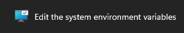
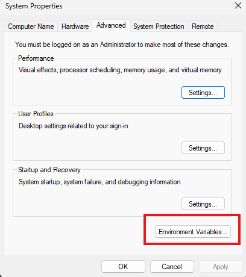
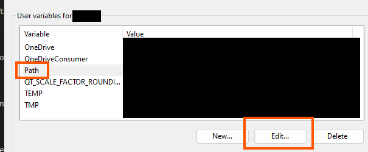
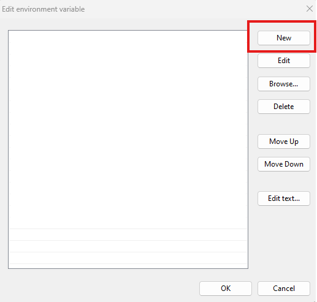
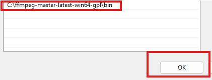
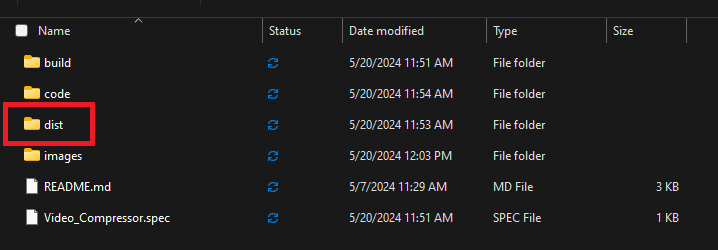

# Video Compressor for Discord

This app compresses your videos down to 25mb or below so you can upload them to a Discord chat without Nitro.

This is useful when you have a 20 second or above gaming clip or screen recording of your desktop that you'd like to share with your friends, but finding a video compressor online is too tedious and those sites can be shady.

The executable will:

    1. Open file explorer and have you select a folder containing videos with the formats : mp4, avi, .mkv, or .mov

    2. Once you select your folder, the code will loop through every file, select the videos in the above formats.
    
    3. Reduce the bitrate while maintaining video quality.
    
    4. Create a new directory called "compressed_videos"
    
    5. Place the videos inside with a size suitable for Discord

### Prerequisites

FFmpeg needs to be installed to your system and added to your PATH for this to work.

Download and Install instructions for Windows 10/11:

    1. If you're on Windows or Linux, go to this link: https://github.com/BtbN/FFmpeg-Builds/releases
        - There are zip files for the system you use here
        - For example, on Windows 11, I clicked "ffmpeg-master-latest-win64-gpl.zip" to install.

    2. Unzip the zip file to whatever location you desire. Ex: "C:\ffmpeg-master-latest-win64-gpl"

    3. To add to PATH, search "environment variables" in Windows Search and click "Edit the system environment variables"

    4. Click Environment Variables...

    5. Highlight "Path" and click "Edit..."

    6. Click "New" to add a new variable

    7. Add the path to where you installed ffmpeg and include "\bin" at the end. This is how you access the ffmpeg executable. Click Ok to save results.

    

### Installation Instructions

To install and run this project on your local machine:

    1. Download the zip file and unzip to your desired folder

    2. Open the folder and the executable is located in the dist directory

