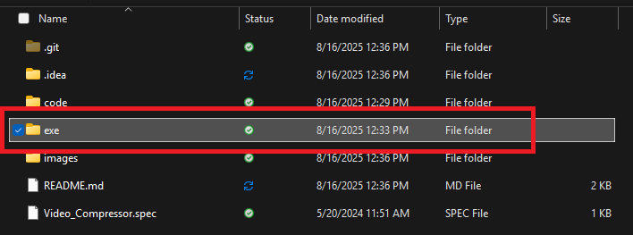

# Video Compressor for Discord

This app compresses your videos down to the size you need so you can upload them to a Discord chat without Nitro.

This is useful when you have a 30 second or above gaming clip or screen recording of your desktop that you'd like to share with your friends, but finding a video compressor online is too tedious and shady.

The executable will:

    1. Ask what size you want your videos compressed to.

    2. Open file explorer and have you select a folder containing videos with the formats : mp4, avi, .mkv, or .mov

    3. Once you select your folder, the code will loop through every file and select the videos in the above formats.
    
    4. It will reduce the bitrate while maintaining video quality.
    
    5. Create a new directory called "compressed_videos"
    
    6. Place the videos inside in a size suitable for Discord.

### Installation Instructions

To install and run this program on your local machine:

    1. Download the zip file and unzip to your desired folder

    2. Open the repo folder and the executable is located in the exe directory

    3. Double click Video_Compressor.exe to run (local install of ffmpeg is not required)

